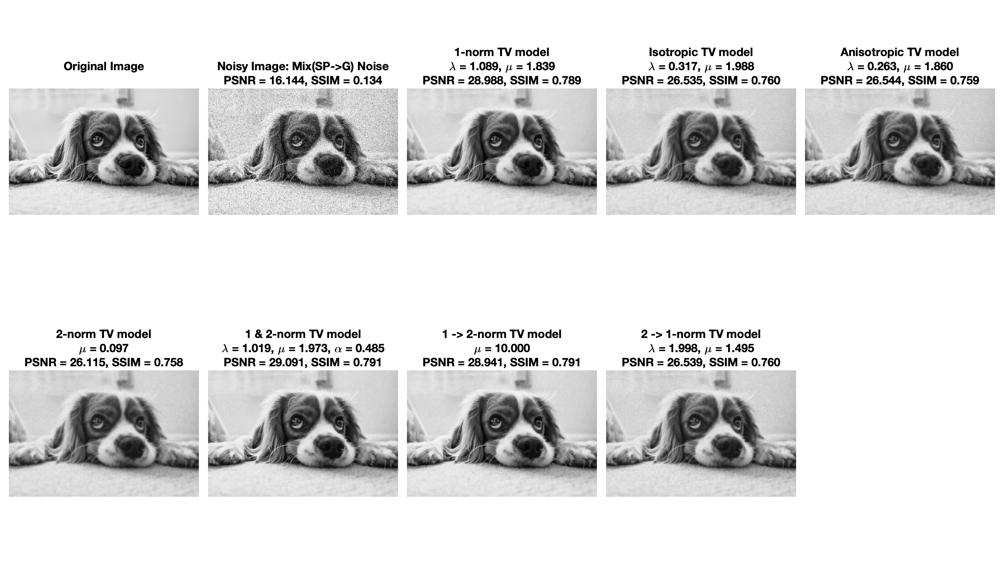

# NCTS_USRP_G6

## Slide
https://www.overleaf.com/project/62cd3ad66132caf57e0a78df

## Lectures
https://hackmd.io/@mhyueh/USRP2022

## Current results

### Mix(G->SP) GRAY Optimal Bayes

### Mix(G->SP) GRAY Optimal Fminsearch

### Mix(SP->G) GRAY Optimal Bayes
